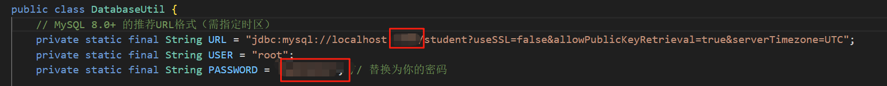

# Student-Information-System
## 用于记录学生信息

## 用法：

在`Student Information System\src`目录下输入命令:

\# 编译（使用分号分隔类路径）

```
javac -cp ".;../lib/*" *.java
```

\# 运行（同样使用分号）

```
java -cp ".;../lib/*" LoginFrame
```

## 前置条件：

1.需要在`DatabaseUtil.java`中修改对应的端口号，账户和密码




2.本地mysql中需要有`student`的数据库和`xuesheng`的表 

> 如果没有请创建
>
> 1.创建`student`数据库：
>
> ```sql
> CREATE DATABASE student CHARACTER SET utf8mb4 COLLATE utf8mb4_general_ci;
> ```
>
> 2.创建`xuesheng`表：
>
> ```sql
> USE student;
> 
> CREATE TABLE xuesheng (
>  xuehao VARCHAR(20) PRIMARY KEY,
>  xingming VARCHAR(50) NOT NULL,
>  xingbie VARCHAR(10),
>  chushengriqi VARCHAR(20),
>  xueyuan VARCHAR(50));
> ```
>
> 3.创建`user`表：
>
> ```sql
> CREATE TABLE user (
>     username VARCHAR(50) PRIMARY KEY,
>     password VARCHAR(50) NOT NULL,
>     is_admin BOOLEAN NOT NULL DEFAULT 0);
> ```
>
> 4.创建`scores`表：
>
> ```sql
> CREATE TABLE scores (
>     student_id VARCHAR(20) PRIMARY KEY,
>     `语文` FLOAT DEFAULT NULL,
>     `高数` FLOAT DEFAULT NULL,
>     `英语` FLOAT DEFAULT NULL,
>     `Java` FLOAT DEFAULT NULL,
>     `Go` FLOAT DEFAULT NULL,
>     `Linux` FLOAT DEFAULT NULL,
>     `双创` FLOAT DEFAULT NULL,
>     `思政` FLOAT DEFAULT NULL,
>     `实训` FLOAT DEFAULT NULL,
>     FOREIGN KEY (student_id) REFERENCES xuesheng(xuehao));
> ```
>
> 
